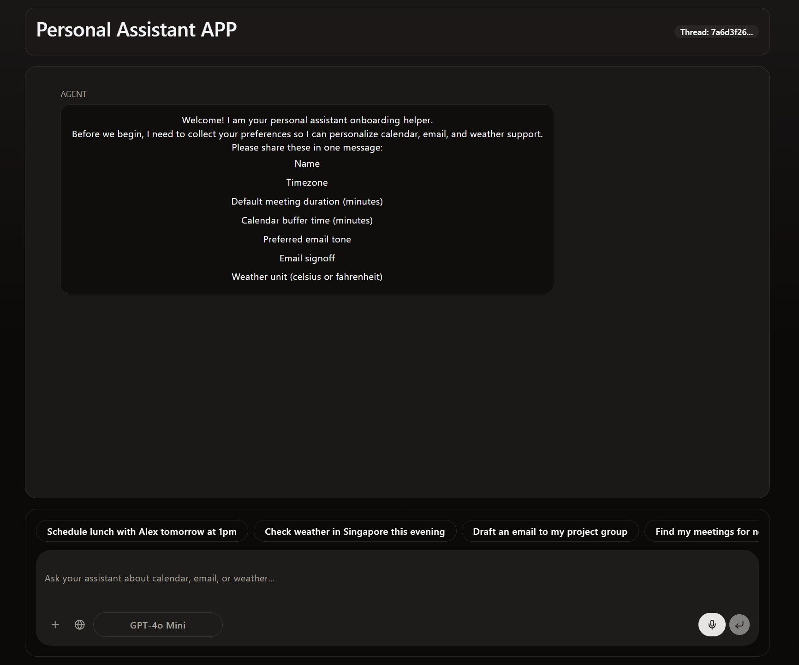
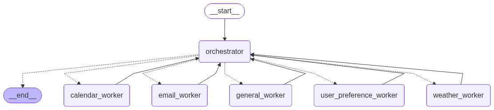
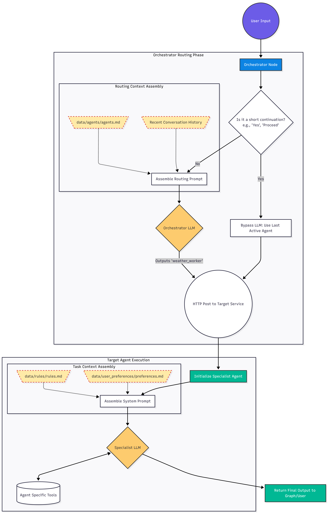

# Multi-Agent Personal Assistant (PA) as a Service

Welcome to the Multi-Agent Personal Assistant (PA) platform! This scalable application provides an intelligent, conversational interface designed to manage your daily schedule, communications, and real-time environmental data queries autonomously. 

At its core, the application acts as a highly capable digital secretary. It operates using specialized AI "agents" that each handle discrete workflows like drafting emails, resolving calendar conflicts, and analyzing complex weather metrics.

---

## 🎥 Demo

Check out the full platform demonstration here:

---

## 🎯 Core Capabilities

**1. Intelligent Email Management (`email_worker`)**
*   **Contextual Reading & Searching:** Intelligently query the inbox to summarize threads or find specific correspondence.
*   **Drafting & Responding:** Draft new emails or reply to existing threads, utilizing the user's customized tonality and default sign-offs.

**2. Proactive Calendar Scheduling (`calendar_worker`)**
*   **Event Lifecycle Management:** Full CRUD capability over the user's calendar.
*   **Conflict Resolution:** Proactively checks for overlapping events and verifies availability before committing meetings to the calendar.

**3. Real-Time Meteorological Intelligence (`weather_worker`)**
*   **Local & Global Forecasting:** Access to up-to-the-minute weather conditions alongside granular metrics like temperature, humidity, wind speed, and rainfall.
*   **Environmental Insights:** Monitor vital safety indices, including UV Index and PSI, as well as extended multi-day outlooks.

**4. Persistent User Personalization (`user_preference_worker`)**
*   **Tailored Experience:** Maintains a dynamic user profile (e.g., timezones, meeting buffers, preferred email tonality) stored in Markdown that is persistently injected into every agent's operational context.

**5. General Queries & Fallback (`general_worker`)**
*   **Conversational Assistant:** Handles standard requests and edge cases that do not require external tooling, ensuring a smooth chat experience.

---

## 🏗 Technical Architecture

The platform is engineered using a robust **Multi-Agent, Service-Oriented Architecture (SOA)**, orchestrated via [LangGraph](https://python.langchain.com/docs/langgraph) and served over [FastAPI](https://fastapi.tiangolo.com/).

### The Orchestrator 
The brain of the operation is the Orchestrator Router. It assesses the user's intent, assembles prompt boundaries using rules and agent descriptions, and decides which downstream worker should handle the task.

### Independent Service Endpoints
Rather than a monolithic codebase, each core capability (Calendar, Email, Weather, Preferences) is decoupled into its own independent HTTP service endpoint. This ensures that:
*   A failure in one service (e.g., Weather API goes down) does not crash the broader graph (e.g., you can still send an email).
*   Services can be scaled independently under heavy load.

### Secure "Human-in-the-Loop" (HITL)
For consequential actions (such as sending an email or deleting a calendar event), the application enforces a strict pause state. Execution is interrupted, and final authorization is explicitly requested from the user before the action is executed.

---

## ⚙️ Overall Workflow & Context Assembly

Our system relies on **Dynamic Context Assembly**. Rather than hard-coding instructions into Python files, the platform dynamically builds agent "brains" on the fly by reading operational markdown files (`agents.md`, `rules.md`, `preferences.md`).

When a user submits a prompt, the system routes the request to the correct agent, instantiates that agent with the appropriate rules and personalizations, executes the tools, and returns the response safely.

