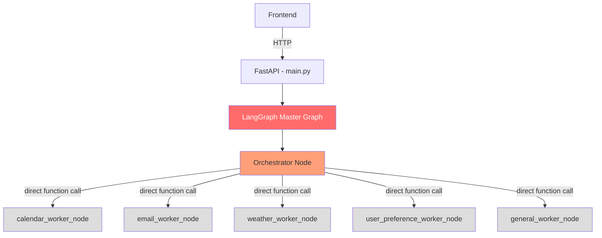
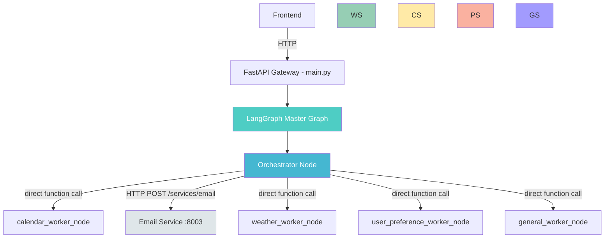

# 🏗️ Refactoring to Service-Endpoint Architecture

## Current Architecture (Before)



**Problems with current approach:**

- All workers are imported directly into `graph.py` → tightly coupled
- Any change to one worker risks breaking the graph
- Cannot scale individual services independently
- Cannot reuse services outside the LangGraph graph
- A failure in any worker can crash the entire graph process

---

## Target Architecture (After)



**Key changes:**

- Each worker becomes its own FastAPI service with its own endpoint
- The orchestrator calls services via HTTP (using `httpx`)
- Services can run in-process (same app, different routers) or out-of-process (separate servers)
- Each service has its own health check, error handling, and can be scaled independently

---

## Implementation Strategy

> [!IMPORTANT]
> We'll use a **hybrid approach**: Services are organized as separate routers within the same FastAPI application first (in-process), but structured so they can be trivially extracted into separate services later. This avoids premature infrastructure complexity while getting all the architectural benefits.

---

## Phase 1: Create Service Layer

### 1.1 New Folder Structure

```
backend/
├── api/
│   ├── main.py                          # FastAPI gateway (unchanged)
│   └── routes/
│       ├── __init__.py                   # Register all routers
│       ├── start.py                      # Health check (existing)
│       └── chat.py                       # Chat SSE endpoint (existing)
├── services/                             # ✨ NEW - Independent service endpoints
│   ├── __init__.py
│   ├── base.py                           # Base service class / shared contracts
│   ├── weather_service.py                # Weather service router
│   ├── calendar_service.py               # Calendar service router
│   ├── email_service.py                  # Email service router
│   ├── preference_service.py             # User preference service router
│   └── general_service.py                # General assistant service router
├── logic/
│   ├── agents/                           # Agent logic stays here (business logic)
│   │   ├── orchestrator.py               # Refactored to call services via HTTP
│   │   ├── weather_agent.py              # Pure agent logic (tools + prompt)
│   │   ├── calendar_agent.py             # Pure agent logic (tools + prompt)
│   │   ├── email_agent.py                # Pure agent logic (tools + prompt)
│   │   ├── user_preference_agent.py      # Pure agent logic (tools + prompt)
│   │   └── general_agent.py              # Pure agent logic (tools + prompt)
│   └── graph/
│       ├── graph.py                      # Refactored graph - workers call services
│       └── state.py                      # Unchanged
├── core/
│   └── lifespan.py                       # Updated to init services
└── utils/
    └── main_utils.py                     # Unchanged
```

### 1.2 Service Contract (Request/Response Schemas)

Create `backend/services/base.py` with shared Pydantic models:

```python
# Every service receives messages and returns messages
class ServiceRequest(BaseModel):
    messages: list[dict]          # Serialized LangChain messages
    thread_id: str
    user_id: str

class ServiceResponse(BaseModel):
    messages: list[dict]          # Serialized response messages
    requires_approval: bool       # HITL flag
    interrupt_details: dict | None
    status: str                   # "success" | "error" | "interrupted"
```

### 1.3 Create Each Service Endpoint

Each service file (e.g. `weather_service.py`) will:

1. Define a FastAPI `APIRouter` with a `POST /services/{name}/invoke` endpoint
2. Deserialize the `ServiceRequest` into LangChain messages
3. Call the existing agent logic (from `logic/agents/`)
4. Return a standardized `ServiceResponse`

Example for weather:

```python
@router.post("/services/weather/invoke")
async def invoke_weather(request: ServiceRequest) -> ServiceResponse:
    agent = _create_weather_react_agent()
    response = agent.invoke({"messages": messages}, config=config)
    return ServiceResponse(messages=serialize(response["messages"]), ...)
```

---

## Phase 2: Refactor the Graph & Orchestrator

### 2.1 Refactor Worker Nodes

Instead of each worker node importing and running an agent directly, each worker node will make an HTTP call to its corresponding service endpoint.

```python
# Before (tightly coupled):
def weather_worker_node(state, config):
    agent = _create_weather_react_agent()
    response = agent.invoke({"messages": state["messages"]}, config=config)
    return {"messages": response["messages"]}

# After (loosely coupled):
async def weather_worker_node(state, config):
    response = await call_service("weather", state, config)
    return {"messages": response.messages}
```

### 2.2 Service Client Helper

Create a shared HTTP client helper in `services/client.py`:

```python
import httpx

SERVICE_REGISTRY = {
    "weather":    "http://localhost:8000/services/weather/invoke",
    "calendar":   "http://localhost:8000/services/calendar/invoke",
    "email":      "http://localhost:8000/services/email/invoke",
    "preferences":"http://localhost:8000/services/preferences/invoke",
    "general":    "http://localhost:8000/services/general/invoke",
}

async def call_service(service_name, state, config):
    url = SERVICE_REGISTRY[service_name]
    payload = ServiceRequest(
        messages=serialize_messages(state["messages"]),
        thread_id=config["configurable"]["thread_id"],
        user_id=config["configurable"].get("user_id", ""),
    )
    async with httpx.AsyncClient(timeout=120) as client:
        resp = await client.post(url, json=payload.model_dump())
        resp.raise_for_status()
        return ServiceResponse(**resp.json())
```

### 2.3 Graph Compilation Unchanged

The `StateGraph` structure stays the same — only the node implementations change from direct function calls to HTTP service calls.

---

## Phase 3: Service Registration & Health Checks

### 3.1 Register Service Routers

Update `api/routes/__init__.py` to include service routers:

```python
from services.weather_service import router as weather_router
from services.calendar_service import router as calendar_router
# ... etc

def register_routes(app):
    app.include_router(start.router)
    app.include_router(chat.router)
    app.include_router(weather_router)
    app.include_router(calendar_router)
    # ... etc
```

### 3.2 Per-Service Health Checks

Each service router gets its own health check:

```
GET /services/weather/health
GET /services/calendar/health
GET /services/email/health
```

### 3.3 Update Main Health Check

The main `/health` endpoint aggregates service health.

---

## Phase 4: Error Handling & Fault Isolation

### 4.1 Service-Level Error Handling

Each service endpoint wraps its logic in try/except and returns structured errors:

```python
class ServiceResponse(BaseModel):
    status: str  # "success" | "error" | "interrupted"
    error: str | None = None
```

### 4.2 Orchestrator Fallback

If a service fails, the orchestrator can:

- Retry once
- Fall back to general_worker
- Return a graceful error message to the user

---

## Execution Order

| Step | Description                        | Files Modified/Created           |
| ---- | ---------------------------------- | -------------------------------- |
| 1    | Create service contracts           | `services/base.py`               |
| 2    | Create message serialization utils | `services/serialization.py`      |
| 3    | Create service client helper       | `services/client.py`             |
| 4    | Create weather service endpoint    | `services/weather_service.py`    |
| 5    | Create calendar service endpoint   | `services/calendar_service.py`   |
| 6    | Create email service endpoint      | `services/email_service.py`      |
| 7    | Create preference service endpoint | `services/preference_service.py` |
| 8    | Create general service endpoint    | `services/general_service.py`    |
| 9    | Refactor graph worker nodes        | `logic/graph/graph.py`           |
| 10   | Register service routers           | `api/routes/__init__.py`         |
| 11   | Update lifespan                    | `core/lifespan.py`               |
| 12   | Update main health check           | `api/routes/start.py`            |

> [!NOTE]
> The existing agent logic in `logic/agents/` is **preserved as-is**. The services act as thin HTTP wrappers around the existing agent code. This minimizes risk and keeps working code intact.

---

## Key Design Decisions

1. **In-process first**: All services run as routers on the same FastAPI app (port 8000). This avoids container/network overhead during development, but the code is structured to extract services later.

2. **HTTP even in-process**: Worker nodes call services via `httpx` even when in the same process. This ensures the interface contract is always enforced and makes extraction trivial.

3. **Existing agents untouched**: The `logic/agents/*.py` files keep their tool definitions, prompts, and agent creation logic. Services import and call them.

4. **HITL preserved**: The service response includes `requires_approval` and `interrupt_details` fields. The chat SSE endpoint handles HITL the same way as before.

---

## Questions for You

1. **In-process vs. separate processes**: Should we start with all services as routers in the same FastAPI app (simpler), or immediately split into separate servers on different ports?

2. **HITL handling**: Currently HITL interrupts are handled by LangGraph's built-in interrupt mechanism. With HTTP services, should the service return the interrupt info and let the orchestrator/graph handle the HITL flow, or should each service handle its own HITL?

3. **State persistence**: Currently the graph uses `AsyncSqliteSaver` for checkpointing. Should each service get its own state store, or continue sharing the central checkpoint?
